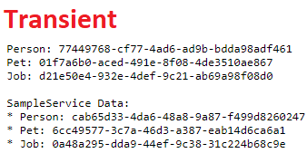

# About

A very simple demo I made to try to understand `AddScoped` vs `AddTransient` in ASP.NET Core.

# Findings

My findings show that when using `AddTransient`, when we DI our dependencies to our controller, it will initialize a new instance each time, not just for the controllers dependencies, but for the services dependencies too:

In contrast, when we use `AddScoped`, the controllers dependencies and the services dependencies will share the same instance of the individual dependencies. This is what's meant by "Shared within the request".

# To run the sample

* Navigate to Startup.cs, and comment out the section you do not with to run, and vice versa.